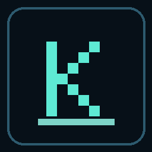

<p align="center">
  
</p>

<p align="center">
  
</p>

<p align="center">
  <b>Kedger</b> is a <b>local-first engineering memory CLI</b> for coding agents.<br/>
  It turns messy IDE sessions into durable memory you can hand to the <i>next</i> agent — on your machine or a teammate’s.
</p>

<p align="center">
  <a href="https://github.com/gaganTakIITD/kedger/actions/workflows/ci.yml"></a>
  <a href="https://pypi.org/project/kedger/"></a>
  <a href="https://pypi.org/project/kedger/"></a>
  <a href="LICENSE"></a>
  <a href="docs/NOT_MODEX.md"></a>
  <a href="CHANGELOG.md"></a>
</p>

## This repo is Kedger — not MoDeX

| | Kedger (here) | MoDeX |
|--|---------------|--------|
| Product | OSS eng-memory **CLI** | Separate hackathon app |
| Binary | `kedger` | not in this repo |
| Private store | `~/.kedger/` | different stack |
| Handoff packs | `*.kxp` | different artifacts |
| Schema | `kedger.memory.v1` | n/a here |

Kedger is **not** “MoDeX OSS”, not “MoDeX v2”, and not a rename. Full note: [`docs/NOT_MODEX.md`](docs/NOT_MODEX.md).

## The idea

Coding agents forget. Context compacts away. Teammates restart cold.

<p align="center">
  
</p>

1. **Session** — Cursor / Claude hooks ingest turns (redacted) into a local store  
2. **Memory** — cognify promotes durable **Anchors** (constraints, rejections, decisions) plus an **ops** layer (files, `+/-`, tool fails)  
3. **Pack** — seal a `.kxp` (optional zlib transcript for lossless restore)  
4. **Next** — your next chat, or a teammate’s agent, hydrates and continues  

No cloud sync required. Keys and store stay under `~/.kedger/` unless you explicitly send a pack.

<p align="center">
  
</p>

## Install (60 seconds)

```bash
cd /path/to/your-app
pip install "kedger>=0.1.1"
kedger init --name alice
```

`init` writes keys, `.kedger/` policy, and IDE hook packs into **this** repo (Cursor + Claude). Trust the workspace / merge Claude settings once, then start a **new** chat.

> Tip is `0.1.1`. If PyPI still only has `0.1.0`:  
> `pip install "kedger @ git+https://github.com/gaganTakIITD/kedger.git@main"`

## CLI (theme listing)

<p align="center">
  
</p>

```bash
kedger doctor                 # health + identity locks
kedger remember reject "…"    # durable policy Anchor
kedger cognify --force --promote
kedger hydrate --live         # what the next agent will see
```

## Two people, two agents

```text
Alice                                         Bob
─────                                         ───
kedger init --name alice                      kedger init --name bob
…agent works…                                 kedger peer card --out bob.kedger.json
                                         ◄──── send card (public keys only)
kedger peer send --to bob.kedger.json --out-dir ./xfer
────── send ./xfer/*.kxp ─────────────────►
                                              kedger peer open hf_….kxp
                                              kedger hydrate --live
                                              → new IDE chat
```

Same person / new machine: `pack-export` → `hydrate --pack` (no peer card).

## Product locks

| Lock | Value |
|------|--------|
| CLI | `kedger` |
| Version tip | `0.1.1` |
| Store | `~/.kedger/` |
| Packs | `*.kxp` |
| Schema | `kedger.memory.v1` |
| Share mode | `explicit_only` |

## Scope

**Shipped:** IDE hooks, deterministic claim extract, dual-layer handoff, zlib transcript, sealed packs, `peer card/send/open`.

**Not yet (Phase F):** LLM distill every turn, sync service, MCP, at-rest DB encryption — [`docs/PHASE_F_DEFERRED.md`](docs/PHASE_F_DEFERRED.md).

## Contributing

- [`CONTRIBUTING.md`](CONTRIBUTING.md) · [`CODE_OF_CONDUCT.md`](CODE_OF_CONDUCT.md) · [`SECURITY.md`](SECURITY.md)
- Publish / GitHub About: [`docs/PUBLISH.md`](docs/PUBLISH.md)
- Architecture: [`docs/OPEN_SOURCE_MEMORY_ARCHITECTURE.md`](docs/OPEN_SOURCE_MEMORY_ARCHITECTURE.md)
- Brand assets: `python3 scripts/render_brand_assets.py`

```bash
pip install -e ".[dev]"
pytest -q
./scripts/smoke_transfer.sh && ./scripts/smoke_wheel_install.sh && ./scripts/smoke_peer_handoff.sh
```

## License

Apache-2.0 — [`LICENSE`](LICENSE).
