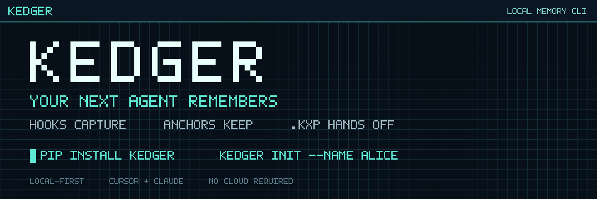
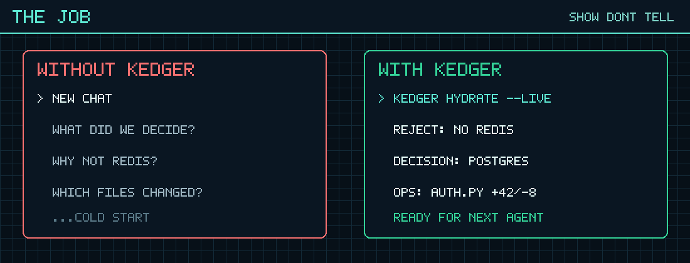
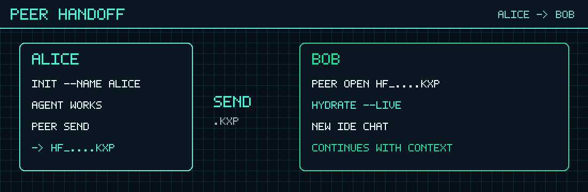
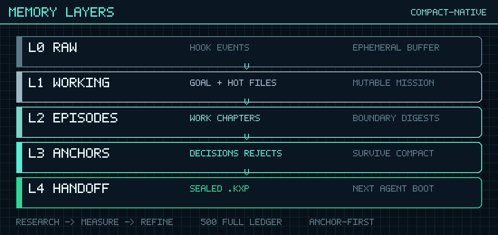
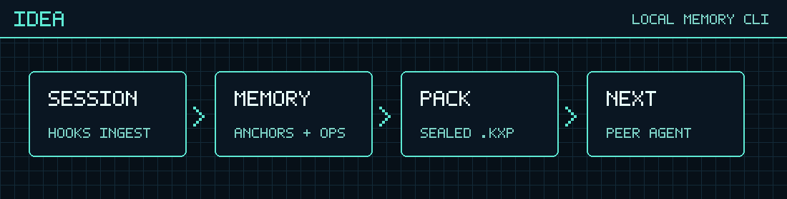
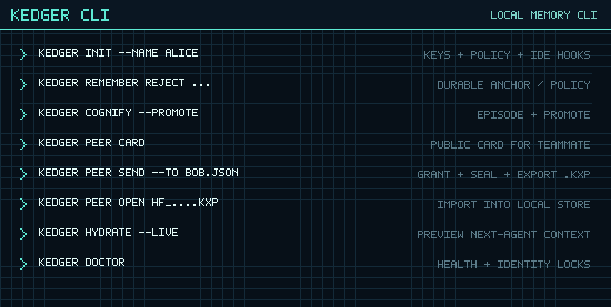

<p align="center">
  
</p>

<p align="center">
  <b>Kedger</b> — casual local-first memory for coding agents.<br/>
  Git remembers <i>what</i> changed. Agent chats remember <i>why</i>… until they don’t.<br/>
  Kedger keeps the <b>why</b> — decisions, rejects, constraints — and lets you hand it to the next agent.
</p>

<p align="center">
  <a href="https://github.com/gaganTakIITD/kedger/actions/workflows/ci.yml"></a>
  <a href="https://pypi.org/project/kedger/"></a>
  <a href="https://pypi.org/project/kedger/"></a>
  <a href="LICENSE"></a>
  <a href="https://github.com/gaganTakIITD/kedger/stargazers"></a>
</p>

<p align="center">
  <a href="#why-use-this"><b>Why</b></a> ·
  <a href="#how-it-helps-a-team"><b>Team</b></a> ·
  <a href="#memory-architecture-l0l4"><b>Memory layers</b></a> ·
  <a href="#why-this-architecture-research"><b>Research</b></a> ·
  <a href="#privacy-tradeoff-why-no-ambient-sharing"><b>Privacy</b></a> ·
  <a href="#install-60-seconds"><b>Install</b></a>
</p>

---

## The problem we’re actually solving

Engineering teams now do real work *inside* Cursor / Claude sessions.

Then the chat ends. Context compacts. A teammate opens the same repo.

Their agent starts **cold**.

You already lived through:

- “Wait, why not Redis?”
- “Didn’t we reject cookie sessions?”
- “Which files did the last agent actually touch?”
- Slack paste that loses half the judgment

**Code is versioned. Judgment isn’t.**

That’s the gap Kedger exists for — not another living wiki of the whole codebase, and not a cloud “team brain” that syncs everything by default.

<p align="center">
  
</p>

## Why use this

Use Kedger if you want the **next agent** (you tomorrow, or a teammate today) to boot with:

1. **What we decided**  
2. **What we rejected** (negative knowledge is gold)  
3. **What constraints still bind**  
4. **What files / ops were in flight**

…without dumping the whole transcript into git, and without putting session memory on someone else’s server.

Skip Kedger if you mainly want a **repo documentation wiki** that drifts with the code graph — different product, different job.

## How it helps a team

Team help here is **handoff**, not ambient contact sharing.

```text
Alice’s agent learns the hard parts
        │
        ▼
   Anchors + ops land in her local store
        │
        ▼
   she seals a .kxp for Bob (on purpose)
        │
        ▼
   Bob opens it → hydrate → new chat continues
```

<p align="center">
  
</p>

So the team benefit is: **judgment can move with the work**, the same way a branch moves — when someone chooses to pass it.

Same person / new laptop works the same way (`pack-export` → `hydrate --pack`). No peer card required.

## Why this shape (and not ambient sharing)

We deliberately chose **`share_mode=explicit_only`**.

| Tempting design | Why we didn’t |
|-----------------|---------------|
| Auto-sync everyone’s agent memory to a shared cloud | Session judgment is sensitive; sync becomes a leak surface |
| Commit memory into the repo as Markdown by default | Mixes private reasoning with code review; wiki drift ≠ session handoff |
| “Always-on team brain” day one | Forces trust + governance before the core loop even works |

**Kedger’s bet:** make capture + Anchors + sealed handoff excellent first.  
Share is a **sealed file** (`.kxp`) you send like a private USB stick — Slack, Drive, USB — encrypted to the recipient’s keys.

No ambient contact graph. No “everyone in the org can read your chat memory.”  
Easy continuity for people **on the task**. Hard/no continuity for everyone else.

## Memory architecture (L0→L4)

Kedger does **not** treat the raw chat log as memory.  
**Lock:** durable memory must be *compact-native*, not compact-rescued — anything that must survive has to live outside the transcript **before** the model window is destroyed.

<p align="center">
  
</p>

| Layer | What it is | Role |
|-------|------------|------|
| **L0 Raw** | Hook events (redacted) | Ephemeral buffer — not “memory” yet |
| **L1 Working** | Goal, hot files, open loops | Tiny mutable mission brain |
| **L2 Episodes** | Boundary digests | Chapters of work after idle / compact / handoff |
| **L3 Anchors** | Decisions, rejects, constraints… | **Survive compact** — semantic judgment |
| **L4 Handoff** | Sealed `.kxp` (+ ops / transcript) | Boot image for the next agent |

```text
hooks → redact → L0
              ↓ patch L1 on state deltas
              ↓ cognify / promote → L2 + L3
              ↓ seal → L4 (.kxp) → hydrate
```

<p align="center">
  
</p>

### Anchors — the atom that must survive

| Kind | Example |
|------|---------|
| **rejection** | “Do not use Redis — use Postgres” |
| **decision** | “Use Argon2id for password hashing” |
| **constraint** | “Must send Idempotency-Key on charge create” |
| goal / next_step / gotcha / open_question | rest of the working set |

Under pressure we keep: constraints → rejections → decisions → goal → next_step → … → raw L0 dies first.

### Ops + graph (shipped alongside Anchors)

- **Ops layer:** files touched, `+/-`, tool fails — so hydrate isn’t only philosophy.  
- **Graph:** Anchors ↔ entities ↔ episodes (ABOUT / SUPERSEDES / SUPPORTS / …). Hydrate walks under a **budget** — no whole-store dump into the prompt.

Constitution: [`docs/OPEN_SOURCE_MEMORY_ARCHITECTURE.md`](docs/OPEN_SOURCE_MEMORY_ARCHITECTURE.md).

## Why this architecture (research)

We didn’t invent layers for branding. The stack is a **research → measure → refine** loop over agent-memory, compaction, graph, privacy, and seal literature.

| Lesson from the corpus | What Kedger locked |
|------------------------|--------------------|
| Compaction is lossy (Claude / MemGPT / KV-eviction lines) | Anchors **before** compact — L3 over “summarize the chat later” |
| Working / episodic / semantic taxonomy (2024–26 surveys) | L1 / L2 / L3 mapped to that taxonomy |
| Episodes + temporal facts (Graphiti/Zep, Nemori, AriGraph) | Episode digests + validity / SUPERSEDES |
| Extract facts, don’t keep transcripts as SoT (Mem0, A-MEM) | Claim extract → promote Anchors |
| Associative retrieve under budget (HippoRAG / GraphReader) | Budgeted notebook walk on hydrate |
| Share leakage / Inv-Scope (ConfAIde, MEXTRA, seal research) | `explicit_only` + sealed `.kxp` + fail-closed open |

**Corpus (honest numbers):** Track 0 keeps a **500-slot FULL deep-read ledger** (~484 distinct arXiv primaries + eng/crypto FULL through Batch25), plus survey-indexed maps and eval harnesses — not keyword theater. Inventory: [`docs/research/CORPUS_INVENTORY.md`](docs/research/CORPUS_INVENTORY.md) · matrix: [`docs/research/KEDGER_STAGE_RESEARCH_MATRIX.md`](docs/research/KEDGER_STAGE_RESEARCH_MATRIX.md) · queue: [`docs/research/queue/FULL_QUEUE_500.md`](docs/research/queue/FULL_QUEUE_500.md).

Influences called out in the constitution include MemGPT, Mem0, Graphiti/Zep, HippoRAG, GraphRAG/LightRAG, Nemori, Cognee, Generative Agents, and the privacy/seal cluster — then **measured** in `tests/eval/` (strict handoff, spectrum insight, share probes).

## Privacy tradeoff

**Defaults that are true today**

- Store lives under `~/.kedger/` (not the source of truth in git)
- Redact-before-persist on ingest
- Share only when you seal + send a `.kxp`
- Peer **card** = public keys only (safe to Slack)
- Unauthorized open fails closed (`not found`) — no “yes that pack exists, here’s a peek”

**Tradeoff we accept**

- You must **actively** send a pack (friction by design)
- Revoke + reseal stops *new* packs; old offline `.kxp` files stay readable to old keys (crypto reality — we say it out loud)
- Full DB at-rest encryption is later ([`docs/PHASE_F_DEFERRED.md`](docs/PHASE_F_DEFERRED.md))

If you didn’t send a pack, they don’t get your session. That’s the product.

## What it looks like

<p align="center">
  
</p>

```bash
kedger remember reject "no Redis — use Postgres"
kedger cognify --force --promote
kedger hydrate --live
# → what the next agent will see
```

## Install (60 seconds)

```bash
pip install "kedger>=0.1.1"
cd /path/to/your-app
kedger init --name alice
```

`init` writes keys, repo policy, and Cursor / Claude hook packs. Trust the workspace once, start a **new** chat, keep working. Kedger captures in the background.

## Two people, two agents

```text
Alice                                         Bob
─────                                         ───
kedger init --name alice                      kedger init --name bob
…agent works…                                 kedger peer card --out bob.kedger.json
                                         ◄──── card (public keys only)
kedger peer send --to bob.kedger.json --out-dir ./xfer
────── send ./xfer/*.kxp ─────────────────►
                                              kedger peer open hf_….kxp
                                              kedger hydrate --live
                                              → new IDE chat with Alice’s Anchors
```

## CLI

<p align="center">
  
</p>

```bash
kedger doctor                 # health + locks (share_mode=explicit_only)
kedger remember reject "…"    # durable Anchor
kedger cognify --force --promote
kedger hydrate --live         # next-agent preview
kedger peer card|send|open    # person-to-person sealed handoff
```

## Product locks

| Lock | Value |
|------|--------|
| CLI | `kedger` |
| Tip | `0.1.1` on [PyPI](https://pypi.org/project/kedger/) |
| Store | `~/.kedger/` |
| Packs | `*.kxp` · `kedger.memory.v1` |
| Share | `explicit_only` |

**Shipped:** hooks, claim extract, Anchors + ops, zlib transcript, sealed packs, peer card/send/open.  
**Not yet:** LLM-every-turn distill, sync service, MCP — [`docs/PHASE_F_DEFERRED.md`](docs/PHASE_F_DEFERRED.md).  
**Proof:** Alpha. Mechanically tested (CI + strict handoff evals). Not a published user study.

## Contributing

- Peer break? → [issue template](https://github.com/gaganTakIITD/kedger/issues/new?template=peer_handoff.yml)
- [`CONTRIBUTING.md`](CONTRIBUTING.md) · [`SECURITY.md`](SECURITY.md) · [`docs/MARKETING.md`](docs/MARKETING.md)
- Architecture constitution: [`docs/OPEN_SOURCE_MEMORY_ARCHITECTURE.md`](docs/OPEN_SOURCE_MEMORY_ARCHITECTURE.md)

```bash
pip install -e ".[dev]"
pytest -q
./scripts/smoke_transfer.sh && ./scripts/smoke_wheel_install.sh && ./scripts/smoke_peer_handoff.sh
```

## License

Apache-2.0 — [`LICENSE`](LICENSE).
