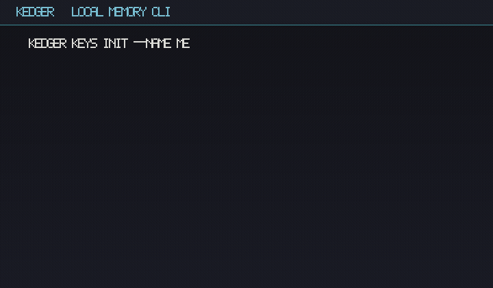

# Kedger

Local-first CLI for durable engineering memory and sealed session handoff.

**Kedger ≠ MoDeX.** MoDeX is a separate hackathon product. Kedger is its own OSS engine: hooks → CLI → Anchors → sealed packs (`.kxp`).



| Lock | Value |
|------|--------|
| CLI | `kedger` |
| Private store | `~/.kedger/` |
| Repo policy | `<repo>/.kedger/` |
| Packs | `*.kxp` |
| Schema | `kedger.memory.v1` |
| Share mode | `explicit_only` |

## Install

From PyPI (when published):

```bash
pip install kedger
```

From this repo (`main`):

```bash
pip install -e ".[dev]"
# or: pip install "git+https://github.com/gaganTakIITD/kedger.git"
```

Requires Python 3.11+.

## Quick start (smoke)

```bash
kedger keys init --name me
kedger remember reject "Do not use cookie sessions" --reason "CSRF"
kedger cognify --force
kedger handoff
kedger hydrate --live
kedger why <anchor_id>
kedger doctor
```

## IDE hooks (Cursor / Claude Code)

This repo dogfoods Kedger via committed project hooks:

- Cursor: [`.cursor/hooks.json`](.cursor/hooks.json) → [`hooks/cursor/`](hooks/cursor/)
- Claude Code: [`.claude/settings.json`](.claude/settings.json) → [`hooks/claude_code/`](hooks/claude_code/)

Install or refresh packs in another repo:

```bash
./hooks/install.sh both   # writes .cursor/hooks.json + .claude settings fragment
```

Adapters call `kedger hook --source cursor|claude_code` with stdin JSON. Core never imports IDE types. Session start returns authorized hydrate context (`additional_context` / `hookSpecificOutput.additionalContext`).

## CLI

| Command | Behavior |
|---------|----------|
| `kedger keys init\|show\|export-recipient` | Ed25519 + X25519 principal under `~/.kedger/keys/` |
| `kedger remember` / `forget` | Anchors; forget via SUPERSEDES |
| `kedger status` / `doctor` | Fingerprint, counts, health |
| `kedger ingest --from-hook` | L0 observation (redact-before-persist) |
| `kedger handoff` / `hydrate` | Seal `.kxp` / authorized open or `--live` rank |
| `kedger grant` / `revoke` | Workstream capability; revoke auto-reseals |
| `kedger share` / `unshare` / `anchors` | Explicit share ladder; Inv-Scope 404 |
| `kedger cognify` / `promote` / `why` | Episodes, promotion, provenance |
| `kedger hook` | IDE adapter entrypoint (Cursor / Claude Code) |

Override home with `KEDGER_HOME` (tests).

## Docs

- Constitution: [`docs/OPEN_SOURCE_MEMORY_ARCHITECTURE.md`](docs/OPEN_SOURCE_MEMORY_ARCHITECTURE.md) (§0A)
- Status: [`docs/IMPLEMENTATION_STATUS.md`](docs/IMPLEMENTATION_STATUS.md)
- Publish / PyPI: [`docs/PUBLISH.md`](docs/PUBLISH.md)
- Phase F (deferred): [`docs/PHASE_F_DEFERRED.md`](docs/PHASE_F_DEFERRED.md)

## Tests

```bash
pytest -q
```

## License

Apache-2.0
