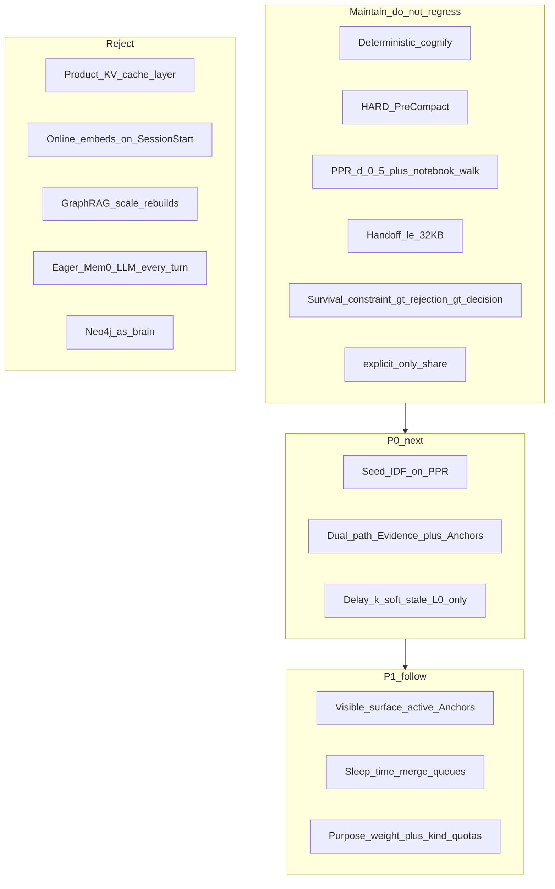

# Kedger Performance Progress Roadmap (Batch26)

> **Date:** 2026-08-09  
> **Branch:** `Cursor/batch26-perf-roadmap-fb37`  
> **Product:** Kedger 0.1.1 tip  
> **Lens:** Cost / latency / token packing for L0→L4 — **not** “add a vector DB”  
> **Live planning surface:** this file (+ mermaid below). No separate canvas MCP in this cloud env — treat this as the roadmap beside chat.

---

## 0. Verdict (one screen)

**Kedger’s L0→L4 design already matches the winning cost pattern in 2025–2026 literature:**  
compact-native Anchors (survive) + budgeted retrieve + sealed ≤32KB handoff + offline cognify/promote decoupled from SessionStart.

**Next performance gains are not “add a vector DB.”** They are:

1. Tighter **online / offline** split (LightMem / All-Mem)  
2. **Dual-path** Evidence + Anchors under 32KB (LeanMem / LightMem-repro)  
3. Smarter **32KB packing** + **seed-IDF PPR** (HippoRAG)  
4. **Delay-k soft-stale on L0 only** — never attention-evict Anchors (online KV compaction for agents)

---

## 1. Research coverage (honest)

| Bucket | Count |
|--------|------:|
| Prior FULL ledger already in repo | ~500 (Batches 4–25) |
| Fresh arXiv scrape (agent-memory + efficiency) | **1674** unique IDs (brief said ~1174 — we got more) |
| Performance-priority runway | **300** |
| Fulltexts fetched / reused this pass | **41** targeted; **39** substantial bodies |
| Bodies mechanism-deep-read this pass (Batch26) | **32** load-bearing set (+ Batch8 re-use for FLARE/IRCoT/CoN/MemoRAG/xRAG/Gist/CCM) |

We did **not** end-to-end read all 1674. We indexed ≥250+ abstracts via API scrape, prioritized 300, and mechanism-deep-read the load-bearing performance set against Kedger code.

**Artifacts**

| Path | Role |
|------|------|
| [`queue/perf_corpus_seed.jsonl`](queue/perf_corpus_seed.jsonl) | 1674 scraped metadata rows |
| [`queue/perf_corpus_seed_1174.jsonl`](queue/perf_corpus_seed_1174.jsonl) | Alias copy (count is **1674**, not 1174 — keep filename for brief compat) |
| [`queue/perf_priority_300.jsonl`](queue/perf_priority_300.jsonl) | Ranked performance runway |
| [`batches/BATCH26_COST_CONSOLIDATE_FULL.md`](batches/BATCH26_COST_CONSOLIDATE_FULL.md) | Agent-memory cost / online-offline |
| [`batches/BATCH26_RETRIEVE_KV_PERF_FULL.md`](batches/BATCH26_RETRIEVE_KV_PERF_FULL.md) | PPR / retrieve / KV eviction lessons |

---

## 2. Map literature → Kedger code today

| Lit pattern | Kedger today | Gap |
|-------------|--------------|-----|
| Online sensory filter + offline sleep consolidate (LightMem) | Hooks→L0 online; cognify/promote on boundaries | No explicit sleep-time merge queue; no topic-group compress before L2 |
| Dual store: compact profiles vs source records (LeanMem) | Anchors + Evidence + optional transcript | Hydrate packs Anchors first; Evidence not dual-pathed under separate byte quotas |
| Visible surface then expand (All-Mem) | `ranked_active_anchors[:5]` seeds + `notebook_walk` | No named “visible surface” cap distinct from walk budget |
| PPR with IDF / node priors (HippoRAG) | `associative_expand` PPR **d=0.5**, uniform seeds | **No IDF / degree prior on seeds** |
| Attention sink + delay compaction (StreamingLLM / agent KV study) | L0 ring warn 0.70 / flush 0.85 | No delay-k soft-stale; Anchors correctly outside attention eviction |
| ≤ context budget packing | `HANDOFF_MAX_BYTES=32768` + survival rank | No per-kind byte quotas; Evidence competes poorly |

**Code anchors:** [`src/kedger/constants.py`](../../src/kedger/constants.py) · [`src/kedger/graph/expand.py`](../../src/kedger/graph/expand.py) · [`src/kedger/hydrate/rank.py`](../../src/kedger/hydrate/rank.py) · [`src/kedger/handoff/compile.py`](../../src/kedger/handoff/compile.py)

---

## 3. Maintain (do not regress)

| Lock | Why literature agrees |
|------|------------------------|
| Deterministic cognify (no LLM SoT) | LightMem-repro: constructed memory ≠ free lunch; retriever/budget dominate |
| HARD PreCompact externalization | MemGPT / Claude compaction lesson — Anchors before window death |
| PPR d=0.5 + notebook walk | GraphReader / HippoRAG family — budgeted associative retrieve |
| ≤32KB handoff | LeanMem / LightMem: tight answering budgets are where structured memory wins |
| Survival rank constraint > rejection > decision | Compact-native survival order |
| `explicit_only` share | Privacy/seal cluster — out of perf scope but non-negotiable |

---

## 4. Pursue next (performance-ranked)

### P0 — Seed IDF on PPR (HippoRAG)

- **Change:** When seeding `associative_expand` / notebook walk, weight seeds by rarity (IDF over entity/statement terms in workstream corpus), not uniform `1.0`.  
- **Keep:** `PPR_DAMPING=0.5`, hop/budget caps.  
- **Eval:** spectrum C01/C07 hydrate quality; multi-hop fixture recall@budget.  
- **Reject:** replacing Anchors with passage RAG.

### P0 — Dual-path Evidence + Anchors under 32KB (LeanMem / LightMem-repro)

- **Change:** Pack compile allocates **separate byte quotas**: Anchors (policy) vs Evidence snippets (fidelity) vs ops. Prefer Anchors under tight budgets; pull Evidence only when query/topic demands (LeanMem adaptive composition).  
- **Eval:** handoff byte histogram; insight under 8KB / 16KB / 32KB caps.  
- **Note:** LightMem-repro — Naive RAG can beat constructed memory at matched depth; Kedger’s win is **policy survival + sealed handoff**, not raw QA vs RAG.

### P0 — Delay-k soft-stale on L0 only (online KV compaction for agents)

- **Change:** Soft-mark L0 rows stale after delay-k boundaries / idle; flush still by warn/flush ratios. **Never** apply attention-eviction logic to L3 Anchors.  
- **Lit:** 2608.00902 — immediate compaction hurts; delaying to use future queries helps. StreamingLLM — sinks ≠ semantic importance.  
- **Reject:** productizing a Kedger KV-cache layer.

### P1 — Visible-surface active Anchors + expand caps (All-Mem)

- Named surface size (e.g. top-K active Anchors) → expand under hop/candidate budgets → re-rank. Mostly a naming + fixture clarification of current seed[:5] + walk.

### P1 — Sleep-time merge queues + purpose weights + per-kind quotas

- Offline queue: merge near-dup Anchors, consolidate episode digests, purpose→kind weights for hydrate. Aligns LightMem sleep-time + existing `--purpose` minimize.

---

## 5. Reject (do not build)

| Temptation | Why reject for Kedger core |
|------------|----------------------------|
| Product KV-cache layer | Inference runtime concern; Anchors are symbolic SoT |
| Online embeds / LLM recognition on SessionStart | Latency + non-determinism; Phase F |
| GraphRAG-scale community rebuilds | Cost spikes; GAM/local-first lesson |
| Eager Mem0-style LLM every turn | Conflicts with deterministic cognify |
| Neo4j-as-brain | SQLite + edges sufficient for v1 budgets |

---

## 6. Measure plan (before coding P0)

| SLI | Fixture / script |
|-----|------------------|
| Hydrate used_bytes ≤ 32768 | existing budgets SLIs |
| Spectrum avg insight ≥ 3.0 (no regress) | `test_handoff_spectrum_10.py` |
| Strict B01–B05 | `test_handoff_quality_strict.py` |
| New: insight @ 8KiB / 16KiB caps | extend spectrum or budgets SLI |
| New: PPR seed-IDF ablate | unit on `associative_expand` ranking |

---

## 7. Implementation status (landed)

| P0 | Code | Eval gate |
|----|------|-----------|
| Seed IDF on PPR | `graph/expand.py` `seed_idf_scores` → `associative_expand` / `notebook_walk` | `tests/eval/test_p0_memory_perf.py::test_seed_idf_boosts_rare_anchor` |
| Dual-path Evidence + Anchors | `handoff/dual_path.py` + `compile.py` + `hydrate/rank.py`; import on hydrate | `test_dual_path_evidence_under_32kb` + insight @ 8/16/32KiB |
| Delay-k soft-stale L0 | `store/db.py` `rotate_observations` (`L0_DELAY_K=3`); Anchors untouched | `test_delay_k_soft_stale_l0_not_anchors` |

**Accuracy probes (same file):** Q1 prompt theme recall · Q2 zlib compress + ranked inject · Q3 2nd-agent policy probe ≥0.75 (ranked projection, not session clone).
